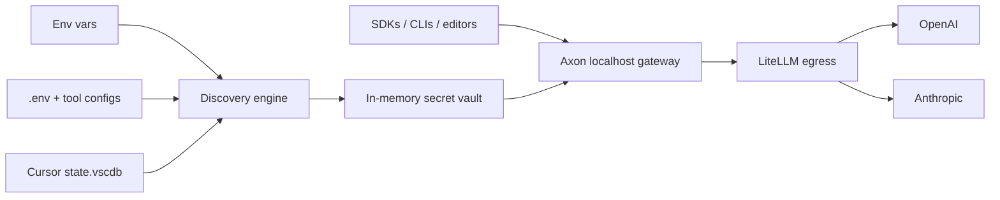

<div align="center">

# Axon

**Local-first LLM routing for machines that already know their keys.**

Axon finds the provider credentials you have already configured, validates them
without exposing raw secrets, and opens one localhost gateway for OpenAI- and
Anthropic-compatible clients.

<p>
  
  
  
  
</p>

`route signals, not secrets`

</div>

---

## Why Axon

Modern LLM work is a routing problem. You may have OpenAI for coding,
Anthropic for long-context reasoning, OpenRouter for experiments, DeepSeek for
cheap bulk work, and half a dozen tools that all want a slightly different
configuration shape.

Axon makes that sprawl feel like one clean local endpoint:

| Without Axon | With Axon |
| --- | --- |
| Paste keys into every tool | Reuse keys already on the machine |
| Guess which provider a key belongs to | Resolve by base URL, prefix, then env name |
| Maintain separate OpenAI and Anthropic proxy setups | Point both SDK families at localhost |
| Wonder whether a key works | Validate with provider-native, zero-cost probes |
| Risk leaking secrets in logs | Show fingerprints only |

The name comes from the axon: the fiber that carries a neuron's output signal to
the right downstream target. Axon does the same job for model traffic.

## The Shape



## Quickstart

Install from a local checkout:

```bash
pip install -e .
```

Discover configured providers. Axon prints fingerprints, never raw keys.

```bash
axon scan
axon scan --validate
```

Run the gateway:

```bash
pip install -e ".[server]"
axon serve
```

Then point clients at Axon:

```bash
# OpenAI-compatible clients
base_url=http://127.0.0.1:4000/v1
model=gpt-4o

# Anthropic-compatible clients, including Claude Code
base_url=http://127.0.0.1:4000
model=claude-sonnet-4-6
```

Served endpoints:

| Surface | Endpoint | Streaming |
| --- | --- | --- |
| OpenAI models | `GET /v1/models` | n/a |
| OpenAI chat | `POST /v1/chat/completions` | Yes |
| Anthropic messages | `POST /v1/messages` | Yes |
| Health | `GET /healthz` | n/a |

## What Is Done

| Milestone | Status | What shipped |
| --- | --- | --- |
| M0 Discovery engine | Done | Env vars, Windows registry, `.env`, known tool configs, Cursor SQLite, provider detection, fingerprint-only output |
| M1 Dual ingress gateway | Done | OpenAI-compatible and Anthropic-compatible APIs backed by LiteLLM, localhost by default |
| M2 Router | Next | Static role-based routing, then cheap-first cascades |
| M3 Dashboard | Next | Active Models view, discovery cards, and cost stats |

Discovery recognizes a broad provider catalog: OpenRouter, Anthropic, DeepSeek,
Google Gemini, Mistral, Groq, xAI, Together AI, Cohere, Perplexity, Azure
OpenAI, and OpenAI. The M1 serving path currently loads OpenAI and Anthropic as
first-class routed providers.

## Security Posture

Axon is a key-aware tool, so its security model is part of the product surface,
not a footnote.

| Rule | Behavior |
| --- | --- |
| Read-only discovery | Config files and databases are opened only for inspection |
| No raw-key output | CLI, logs, and display paths use fingerprints only |
| Provider-native probes | Validation calls only the resolved provider endpoint |
| In-memory serving vault | `axon serve` holds usable keys only inside the running process |
| Localhost by default | Non-localhost binds are refused unless `AXON_API_KEY` is set |
| Egress hardening | Client-supplied `api_key`, `api_base`, `base_url`, and related steering fields are stripped before provider calls |

Read the full model in [SECURITY.md](SECURITY.md).

## Development

```bash
pip install -e ".[dev]"
python -m pytest -q
```

## License

MIT.
