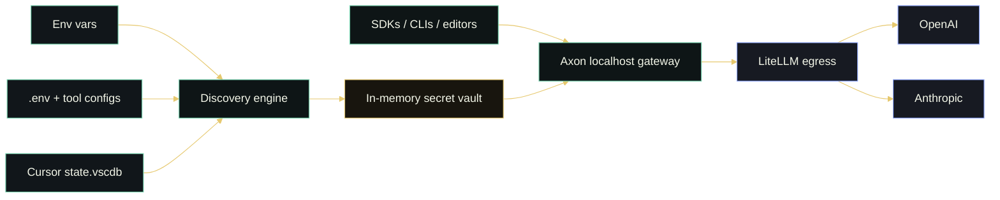

<p align="center">
  
</p>

<div align="center">

# Axon

**A local neural switchboard for LLM traffic.**

Axon discovers provider credentials already living on your machine, validates
them without exposing raw secrets, and opens one crisp localhost gateway for
OpenAI- and Anthropic-compatible clients.

<p>
  
  
  
  
</p>

<p>
  <a href="#signal-deck">Signal deck</a> /
  <a href="#quickstart">Quickstart</a> /
  <a href="#control-surface">Control surface</a> /
  <a href="#security-model">Security model</a>
</p>

`scan -> fingerprint -> vault -> route`

</div>

---

## Signal Deck

Modern LLM work is no longer "pick one model and pray." It is a live routing
problem: premium models for deep work, fast models for search, cheap models for
bulk passes, and provider keys scattered across tools that all expect different
shapes.

Axon turns that sprawl into one local control surface.

| Old workflow | Axon workflow |
| --- | --- |
| Paste keys into every client | Reuse credentials already configured on the machine |
| Guess which provider a key belongs to | Resolve by base URL, distinctive prefix, then env name |
| Maintain separate proxy setups | Point OpenAI and Anthropic SDKs at one localhost gateway |
| Wonder whether a key authenticates | Probe the provider's own endpoint with zero-cost validation |
| Risk secrets in logs and screenshots | Display fingerprints only |

The name comes from the axon: the fiber that carries a neuron's output signal to
the right downstream target. Axon does the same job for model traffic.

## Quickstart

```bash
pip install -e .
axon scan
axon scan --validate
```

Run the gateway:

```bash
pip install -e ".[server]"
axon serve
```

Point clients at Axon:

```bash
# OpenAI-compatible clients
base_url=http://127.0.0.1:4000/v1
model=gpt-4o

# Anthropic-compatible clients, including Claude Code
base_url=http://127.0.0.1:4000
model=claude-sonnet-4-6
```

## Control Surface

| Command | What it does | Secret behavior |
| --- | --- | --- |
| `axon scan` | Finds configured providers from env vars and known tool configs | Prints fingerprints only |
| `axon scan --validate` | Checks which keys authenticate | Calls only the resolved provider endpoint |
| `axon serve` | Starts the dual-ingress gateway on `127.0.0.1:4000` | Keeps usable keys in memory only |
| `AXON_API_KEY=... axon serve --host 0.0.0.0` | Enables authenticated non-localhost serving | Requires inbound `Authorization` or `x-api-key` |

Served endpoints:

| Surface | Endpoint | Streaming |
| --- | --- | --- |
| OpenAI models | `GET /v1/models` | n/a |
| OpenAI chat | `POST /v1/chat/completions` | Yes |
| Anthropic messages | `POST /v1/messages` | Yes |
| Health | `GET /healthz` | n/a |

## Routing Map



## Roadmap

| Milestone | Status | Scope |
| --- | --- | --- |
| M0 Discovery engine | Done | Env vars, Windows registry, `.env`, known tool configs, Cursor SQLite, provider detection, fingerprint-only output |
| M1 Dual ingress gateway | Done | OpenAI-compatible and Anthropic-compatible APIs backed by LiteLLM, localhost by default |
| M2 Router | Next | Static role-based routing, then cheap-first cascades |
| M3 Dashboard | Next | Active Models view, discovery cards, and cost stats |

Discovery recognizes OpenRouter, Anthropic, DeepSeek, Google Gemini, Mistral,
Groq, xAI, Together AI, Cohere, Perplexity, Azure OpenAI, and OpenAI. The M1
serving path currently loads OpenAI and Anthropic as first-class routed
providers.

## Security Model

Axon is a key-aware tool, so the security model is not a footnote. It is the
shape of the product.

| Rule | Behavior |
| --- | --- |
| Read-only discovery | Config files and databases are opened only for inspection |
| No raw-key output | CLI, logs, and display paths use fingerprints only |
| Provider-native probes | Validation calls only the resolved provider endpoint |
| In-memory serving vault | `axon serve` holds usable keys only inside the running process |
| Localhost by default | Non-localhost binds are refused unless `AXON_API_KEY` is set |
| Egress hardening | Client-supplied `api_key`, `api_base`, `base_url`, and related steering fields are stripped before provider calls |

Read the full model in [SECURITY.md](SECURITY.md).

## Development

```bash
pip install -e ".[dev]"
python -m pytest -q
```

## License

MIT.
